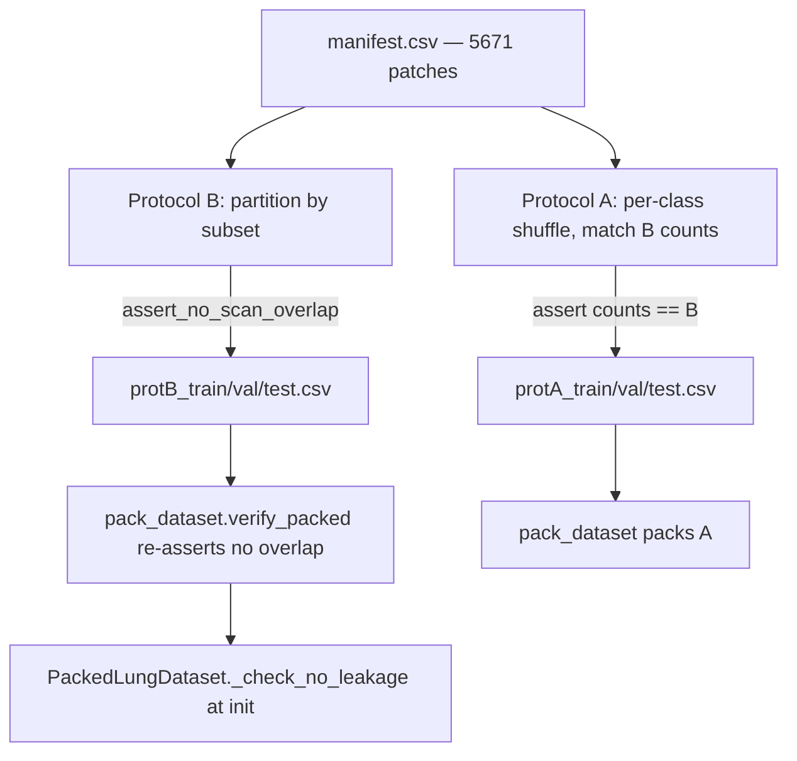

# Measuring the Cost of a Quiet Mistake: How Data Leakage Inflates Reported Performance in Deep-Learning Lung-Nodule Detection on LUNA16

*A layered technical thesis — readable by a curious 10-year-old, a medical student, a machine-learning engineer, and a senior researcher, each at their own level.*

---

> **How to read this document.** Almost every chapter is written in three layers:
> - 🧒 **In plain words** — a short box anyone can follow, using everyday pictures.
> - 🔬 **Going deeper** — the real technical detail, exact numbers, and pointers to the actual code.
> - 🎓 **For the researcher** — rigor, trade-offs, and honest limitations.
>
> Read only the layers you want. Acronyms are spelled out the first time they appear. There is a full glossary at the end.

---

## Abstract

Artificial-intelligence (AI) systems that read computed-tomography (CT) scans of the lungs often report near-perfect accuracy in academic papers. A recurring reason for these inflated numbers is **data leakage**: information from the test set quietly reaches the model during training, so the reported score measures memorisation rather than genuine generalisation. This project asks a single, concrete question:

> **How much does data leakage inflate measured performance when detecting pulmonary nodules in CT scans?**

We answer it by training the *same* model, on the *same* data, under two carefully matched splitting protocols on the public **LUNA16** (LUng Nodule Analysis 2016) dataset:

- **Protocol A — leaky.** Image patches are split into train/validation/test *at the slice level*, so different slices of the same patient's scan can land on both sides of the split.
- **Protocol B — clean.** Whole patients (scans) are split, so no patient ever appears on both sides.

Both protocols are constructed to have **identical class counts in every split**, so the only thing that differs is *whether patient information leaks*. The difference in their scores is therefore a clean estimate of the leakage effect.

For a ResNet-50 (a 50-layer Residual Network) classifier, the headline result on the validation set is:

| Protocol | Best validation AUROC | Sensitivity | Specificity |
|---|---|---|---|
| **A (leaky)** | **0.9795** | 0.9012 | 0.9618 |
| **B (clean)** | **0.9511** | 0.8025 | 0.9663 |
| **Leakage inflation** | **≈ +0.028 AUROC** | — | — |

AUROC is the Area Under the Receiver-Operating-Characteristic Curve, a 0.5-to-1.0 score where 0.5 is random guessing and 1.0 is perfect. The leaky protocol scores about **2.8 AUROC points higher** for no reason other than leakage.

Along the way, this project also documents a subtler and more dramatic leak — a **preprocessing bug** that briefly drove validation AUROC to a perfect **1.0** by accidentally teaching the model *where in the image to look* rather than *what a nodule looks like*. Fixing it dropped a trivial brightness-only classifier from ≈1.0 to **0.541** (essentially chance), confirming the shortcut was gone. We treat that bug as a teaching case study in how innocent-looking data choices manufacture leakage.

---

## Table of contents

1. [Why this project exists](#1-why-this-project-exists)
2. [Biological and medical background](#2-biological-and-medical-background)
3. [The data: LUNA16 and LIDC-IDRI](#3-the-data-luna16-and-lidc-idri)
4. [Methodology I — Preprocessing (and the bug that taught us everything)](#4-methodology-i--preprocessing-and-the-bug-that-taught-us-everything)
5. [Methodology II — The two split protocols](#5-methodology-ii--the-two-split-protocols)
6. [Methodology III — Models and training](#6-methodology-iii--models-and-training)
7. [A harder cousin: the malignancy-proxy task](#7-a-harder-cousin-the-malignancy-proxy-task)
8. [How to reproduce everything](#8-how-to-reproduce-everything)
9. [Results and expected findings](#9-results-and-expected-findings)
10. [Limitations, ethics, and future work](#10-limitations-ethics-and-future-work)
11. [Glossary](#11-glossary)
12. [References](#12-references)

A note on completeness: the `resnet50` Protocol A and Protocol B runs are **finished**, and their **validation** numbers below are real, read directly from the saved `metrics.json` files. Held-out **test-set** numbers, and results for the other three architectures and the malignancy task, are **not yet computed** and appear as clearly-labelled placeholders.

---

## 1. Why this project exists

> 🧒 **In plain words**
> Lungs are the two spongy balloons in your chest that let you breathe. Sometimes a tiny lump grows inside them. Most lumps are harmless, but a few are the very start of cancer — and cancer in the lungs is most dangerous when nobody notices it until late. Special cameras called CT scanners can take pictures of the inside of the chest and spot these tiny lumps early, when doctors can still help. Computers can be trained to point at the lumps too, like a spell-checker for X-ray pictures. But here's the catch: sometimes a computer *looks* like a genius on a test only because it secretly peeked at the answers. This project measures exactly how much "peeking" can fool us into thinking the computer is smarter than it really is.

> 🔬 **Going deeper**
> Lung cancer is one of the deadliest cancers largely because it is usually found late, after it has spread. Large screening trials have shown that CT screening of high-risk people can catch cancers earlier and reduce deaths. CT produces a 3-D image in which small **pulmonary nodules** (round spots in lung tissue) can be seen. Radiologists must scan many slices per patient, which is slow and easy to miss things in — a natural fit for AI assistance.
>
> The problem is that the AI literature is full of suspiciously high numbers. A very common cause is **data leakage**: the model is evaluated on data that is not truly independent of its training data, so the reported score overestimates how well it would do on genuinely new patients. The most insidious form in medical imaging is *patient leakage* — multiple images from one patient end up in both the training and test sets, letting the model recognise the patient instead of the disease.
>
> This project's research question is deliberately narrow and measurable: **how large is that inflation?** We isolate it by building two splits that are identical in every measurable way (same images, same per-class counts in each split) except for whether they leak patient identity. See `GPU_TRAINING_HANDOFF.md` §1: *"Comparing Protocol A (scan-level split, leaky) vs Protocol B (patient-level split, clean) on LUNA16 CT data to measure how much data leakage inflates model performance. The headline result is the A-vs-B val/test AUROC gap."*

> 🎓 **For the researcher**
> Framing leakage as a *controlled intervention* — hold the dataset, model, optimiser, and class balance fixed; vary only the split grouping — turns a vague worry into a quantitative estimate. The matched-count design (Chapter 5) removes the obvious confounders (dataset size, class prior) so the A−B gap is attributable to grouping. This does not capture *every* leakage mechanism (e.g. preprocessing-induced leakage, which we encountered separately in Chapter 4), but it gives a defensible lower bound on the inflation a patient-naïve split would produce in this setting.

---

## 2. Biological and medical background

> 🧒 **In plain words**
> Imagine your chest holds two sponges — your **lungs**. When you breathe in, air fills millions of tiny pockets in the sponge and hands oxygen to your blood. **Cancer** happens when one cell forgets the rules and copies itself over and over into a lump that doesn't belong. In the lung, a small lump is called a **nodule**. Most nodules are nothing to worry about (like a freckle), but a few are baby cancers. A **CT scanner** is a doughnut-shaped machine that spins an X-ray camera around you and builds a stack of picture-slices, like a loaf of bread you can flip through. Different stuff in your body lets through different amounts of X-ray, so bone looks bright, air looks black, and soft squishy bits look grey. Doctors set the picture's brightness to a "lung setting" so the lumps stand out.

> 🔬 **Going deeper**
> - **Lungs** exchange oxygen and carbon dioxide across the alveolar membrane. Healthy lung is mostly air, so on CT it is very dark.
> - **Cancer** is uncontrolled cell proliferation. A **pulmonary nodule** is a small (typically < 30 mm) rounded opacity in the lung. The *risk* a nodule carries rises with size, growth, and certain shapes (spiculated/irregular margins). Tiny nodules are usually followed up; larger ones may warrant biopsy or positron-emission tomography (PET).
> - **CT (computed tomography)** rotates an X-ray source/detector around the patient and reconstructs cross-sectional slices, stacked into a **3-D volume** indexed by (z, y, x) voxels. Each voxel stores a **Hounsfield Unit (HU)** — a calibrated radiodensity where water = 0 HU and air = −1000 HU by definition.

> | Tissue | Approx. HU |
> |---|---|
> | Air (in airways/background) | ≈ −1000 |
> | Lung parenchyma (mostly air) | ≈ −700 to −600 |
> | Fat | ≈ −100 to −50 |
> | Water | 0 |
> | Soft tissue / muscle | ≈ +40 to +80 |
> | Bone | ≈ +400 to +1000+ |
>
> Because the full HU range is enormous, radiologists view a **window** — a center and width that map a chosen HU band onto the visible grey-scale. This project uses a **lung window**: `hu_center = -600.0`, `hu_width = 1500.0` (defined in `src/config.py`, `ExperimentConfig`). That window spans `[-1350, +150]` HU, which keeps lung tissue and nodules well-contrasted while clipping away extreme densities. Anything below −1350 or above +150 is flattened to black or white respectively.
>
> **Malignant vs benign**: *malignant* means cancerous (able to invade and spread); *benign* means non-cancerous. The primary task in this project does not predict malignancy directly — it predicts *nodule vs not-a-nodule*. A separate, harder "malignancy-proxy" task (Chapter 7) uses nodule *size* as a stand-in for risk.

> 🎓 **For the researcher**
> The lung window choice is a modelling decision with consequences. Clipping to `[-1350, 150]` HU discards bone and dense-tissue detail that is irrelevant to parenchymal nodules but would otherwise dominate the dynamic range after 8-bit quantisation. It also standardises contrast across scanners. The trade-off is that any signal living outside the window (e.g. calcified nodules with very high HU, a benign-favouring feature) is partially censored — a limitation to keep in mind when interpreting sensitivity/specificity.

---

## 3. The data: LUNA16 and LIDC-IDRI

> 🧒 **In plain words**
> Scientists put together a big public photo album of lung CT scans so everyone can test their computer programs on the same pictures. It's called **LUNA16**. The pictures come from an even bigger collection called **LIDC-IDRI**, where expert doctors carefully circled the lumps. LUNA16 comes split into 10 boxes (called "subsets"). It also ships two answer-keys: one listing where the real lumps are, and one listing thousands of "maybe-spots" the computer should *also* learn to recognise as *not* lumps.

> 🔬 **Going deeper**
> **LUNA16** (LUng Nodule Analysis 2016) is a curated subset of **LIDC-IDRI** (Lung Image Database Consortium and Image Database Resource Initiative). Key structure:
> - **Scans** are stored as `.mhd`/`.raw` pairs (MetaImage header + raw voxels), loadable with **SimpleITK** (`sitk`). Each scan is a 3-D HU volume.
> - **Subsets**: LUNA16 is distributed as `subset0` … `subset9`. *This project uses subsets 0–6 only* (the ones present on disk). Per `src/config.py`: training = subsets `(0,1,2,3,4)`, validation = subset `(5,)`, test = subset `(6,)`.
> - **`annotations.csv`** lists confirmed nodules: `seriesuid, coordX, coordY, coordZ, diameter_mm`. The world coordinates are in millimetres; `diameter_mm` drives the malignancy-proxy labels in Chapter 7.
> - **`candidates.csv`** lists candidate locations with a `class` column: `class==1` are nodules, `class==0` are *real non-nodule lung locations*. The `class==0` rows are the source of our negative (normal) patches — a detail that turns out to be crucial (Chapter 4).
>
> After preprocessing, the project's own **manifest** records every extracted 2-D patch. The merged manifest contains **5671 rows** with **0 duplicate files** (`GPU_TRAINING_HANDOFF.md` §STATUS). Each row (a `ManifestRow` `TypedDict` in `src/data/`) carries: `filepath, scan_id, subset, class_name, label, slice_z, nodule_uid`.

> **Patch counts actually used (per protocol, after the bug fix):**
>
> | Split | Total | Nodule | Normal |
> |---|---|---|---|
> | Train (subsets 0–4) | 4070 | 1845 | 2225 |
> | Validation (subset 5) | 769 | 324 | 445 |
> | Test (subset 6) | 832 | 387 | 445 |
> | **All** | **5671** | — | — |

> 🎓 **For the researcher**
> Using only subsets 0–6 (not the full 10) reduces the sample size and means cross-validation over all official folds is not performed here; results are reported on a single fixed val/test partition. The `scan_id` field is the patient/scan identifier (the DICOM series instance UID) and is the linchpin of the clean split — every leakage guard in the codebase keys on it. Because LIDC-IDRI annotations reflect multi-radiologist consensus, label noise exists (inter-reader disagreement on what counts as a nodule); LUNA16's candidate list is itself the output of earlier detection systems, so the `class==0` "normals" are *hard negatives* — locations that looked nodule-like enough to be flagged. That makes them a more honest negative class than random lung points (and far more honest than image centres — see next chapter).

---

## 4. Methodology I — Preprocessing (and the bug that taught us everything)

This chapter has two halves: the preprocessing pipeline, then the bug case study. The code lives in `src/data/lidc_prepare.py`.

### 4.1 The preprocessing pipeline

> 🧒 **In plain words**
> A raw CT scan is a giant 3-D block of numbers — far too big and too gray to feed a computer directly. So we do four things, like preparing ingredients before cooking: (1) set the picture to the "lung brightness" and turn it into a normal 0-to-255 grey image; (2) translate the doctor's "the lump is *here* in millimetres" into "the lump is at *this pixel*"; (3) cut out a fixed-size square around the lump — always 64 millimetres of real chest — and shrink it to a tidy 224×224 picture; (4) save three neighbouring slices per lump (the one through the middle and one just above and below), because a lump is a little ball, not a flat dot.

> 🔬 **Going deeper** — each step, and *why*:
>
> **Step 1 — HU windowing → 8-bit (`apply_hu_window`).** The int16 HU volume is clipped to `[hu_lower, hu_upper] = [-1350, 150]` and linearly rescaled to `uint8 [0, 255]`:
> ```python
> clipped = np.clip(volume.astype(np.float32), hu_lower, hu_upper)
> scaled  = (clipped - hu_lower) / (hu_upper - hu_lower) * 255.0
> return scaled.astype(np.uint8)
> ```
> *Why:* standardises contrast across scanners and matches the 8-bit input ordinary vision backbones expect.
>
> **Step 2 — world → voxel (`world_to_voxel`).** Annotation/candidate coordinates are in millimetres; we convert them to integer voxel indices using SimpleITK's calibrated geometry:
> ```python
> vox = img.TransformPhysicalPointToIndex(coord_world)   # (x, y, z)
> ```
> *Why:* the CSVs speak millimetres; the array speaks indices. The image's spacing/origin/direction make the mapping correct even when scans have different voxel sizes.
>
> **Step 3 — physical crop → resize (`extract_patch`, `mm_to_pixels`).** A `crop_mm = 64.0` mm square is taken around `(ix, iy)` on slice `iz`, padded with 0 (window minimum, i.e. "air") at borders, then resized to `output_px = 224` (224×224) with bilinear interpolation:
> ```python
> pil = Image.fromarray(patch, mode="L")
> return pil.resize((output_px, output_px), Image.BILINEAR)
> ```
> *Why crop in millimetres, not pixels:* different scans have different in-plane spacing, so a fixed *pixel* crop would capture different amounts of anatomy. A fixed *physical* crop (64 mm) keeps the real-world field of view constant; `mm_to_pixels(mm, spacing_xy)` converts it per-scan.
>
> **Step 4 — three slices per nodule.** `slices_per_nodule = 3` extracts `iz-1, iz, iz+1` (clamped to the volume), each saved as its own patch. *Why:* a nodule is a 3-D object; neighbouring slices give the model a little volumetric context and triple the positive examples without needing a 3-D network.
>
> **Negative (normal) patches.** `normal_slices_per_scan = 5` negatives are drawn per scan. **Crucially**, they are sampled from `candidates.csv` rows with `class==0`. The code (`lidc_prepare.py:201-231`) uses a per-scan deterministic random generator so the sample is reproducible but varied:
> ```python
> rng = np.random.default_rng(_scan_seed(scan_uid))
> n_sample = min(cfg.normal_slices_per_scan, n_candidates)
> sampled_idx = rng.choice(n_candidates, size=n_sample, replace=False)
> ```

### 4.2 The bug that taught us everything

> 🧒 **In plain words**
> The first version had a sneaky mistake. The "lump" pictures were cut out *around the lump*, which sits out near the edge of the lung. But the "no-lump" pictures were cut out from the *middle of every slice* — and the middle of the chest is the bright, busy area with the heart, spine, and big blood vessels (it's called the **mediastinum**). So the computer didn't learn "lump vs no-lump" at all. It learned "edge of lung vs middle of chest" — basically *where the picture was cut from*. That's so easy that it scored a perfect 1.0, like acing a test because every right answer was written in a different colour. We fixed it by cutting the "no-lump" pictures from real lung spots too, so both kinds of picture come from the same neighbourhoods. After the fix, a cheater that only looks at overall brightness scored 0.541 — basically a coin flip — proving the easy shortcut was gone.

> 🔬 **Going deeper**
> The symptom (recorded in `CONTEXT_2026_06_11.md` and `GPU_TRAINING_HANDOFF.md` §2): the first `resnet50_protB` run hit `val_auroc = 1.0` at **epoch 5**, on the supposedly *clean* split.
>
> The root cause was **not** split leakage. It was a **patch-location artifact**:
> - **Positives** were cropped centred on the nodule → peripheral lung.
> - **Negatives** were cropped at the **geometric centre of the slice** → mediastinum/spine.
>
> The two classes were therefore separable by *position and brightness alone*. The model learned "centre vs. periphery," a trivial cue that saturates AUROC under *both* protocols and **masks the very leakage gap the study exists to measure**.
>
> **The fix** (now in `lidc_prepare.py:201-205`, quoted verbatim):
> ```python
> # ── Normal slices ──────────────────────────────────────────────────────
> # Negatives are drawn from LUNA16 candidate locations with class==0 (real
> # non-nodule lung positions), so they share the positives' spatial/anatomical
> # distribution. Sampling the slice centre instead would put every negative on
> # the mediastinum/spine, making the task trivially separable (location, not
> # nodule presence). Candidates are already non-nodule, so no z-exclusion needed.
> ```
> All processed PNGs, manifests, splits, and packed arrays were regenerated, and the old degenerate checkpoint was deleted.
>
> **The verification.** A trivial **mean-brightness classifier** — predict "nodule" from the average pixel value of the patch, no learning at all — was scored on the fixed data. It achieved **AUROC 0.541** (≈ chance), versus ≈1.0 under the bug (`GPU_TRAINING_HANDOFF.md` §STATUS). That single number is the proof the whole-image shortcut is gone: if brightness alone can't beat a coin flip, the easy location cue has been removed and a model that does well must be using genuine local texture.

> 🎓 **For the researcher**
> This is a textbook example of **shortcut learning via preprocessing-induced leakage**, and it is more dangerous than ordinary patient leakage because it inflates *both* arms of the experiment and therefore hides the effect under study. Three methodological points worth emphasising:
> 1. **A near-perfect score early in training is a red flag, not a triumph.** The handoff explicitly instructs: if Protocol B still saturates at ~1.0 by epoch 5 after the fix, *stop and investigate* possible residual separability (e.g. candidate z-range bias).
> 2. **Negatives must share the positives' nuisance distribution.** Using `candidates.csv class==0` makes the negatives *hard negatives* drawn from the same spatial/anatomical neighbourhood as nodules, so the discriminative signal must be local nodule texture, not global position or intensity.
> 3. **Cheap adversarial probes are invaluable.** The mean-brightness AUROC is a one-line sanity check that catches an entire family of intensity/location shortcuts. Building such probes into the pipeline is cheap insurance against silent leakage.

---

## 5. Methodology II — The two split protocols

The split code lives in `src/data/make_luna_splits.py`. This chapter is the heart of the study.

> 🧒 **In plain words**
> To test if a student really learned, you give them questions they've never seen. If some test questions secretly appeared in their homework, their score is fake. The same thing happens with patients. Each patient gives us several picture-slices. **Protocol A** shuffles all the *slices* into piles, so slices from the same patient can land in both the "study" pile and the "exam" pile — that's cheating. **Protocol B** shuffles the *patients* instead, so a patient is either entirely in "study" or entirely in "exam," never both — that's fair. We build both, make sure they have the exact same number of each kind of picture, and then compare scores. The gap is the size of the cheating.

> 🔬 **Going deeper**
>
> **Protocol B — clean / patient-level (`make_protocol_b_splits`).** Rows are partitioned by LUNA16 subset, and the code *asserts* there is no patient overlap:
> ```python
> train = df[df.subset.isin(train_subsets)].reset_index(drop=True)
> val   = df[df.subset.isin(val_subsets)].reset_index(drop=True)
> test  = df[df.subset.isin(test_subsets)].reset_index(drop=True)
> assert_no_scan_overlap(train, val, test, label="Protocol B")
> ```
> The guard itself collects the intersections of `scan_id` sets and fails loudly if any are non-empty:
> ```python
> tv = set(train.scan_id) & set(val.scan_id)
> tt = set(train.scan_id) & set(test.scan_id)
> vt = set(val.scan_id) & set(test.scan_id)
> ...
> assert not violations, f"{label} scan_id overlap detected:\n" + "\n".join(violations)
> ```
>
> **Protocol A — leaky / slice-level (`make_protocol_a_splits`).** For each class, rows are sorted by `filepath`, shuffled with a fixed seed (42), then sliced into train/val/test using **exactly Protocol B's per-class counts**:
> ```python
> """Stratified slice-level shuffle matched to Protocol B's exact per-class counts.
> ...
> Result: identical N and class balance to Protocol B; only grouping differs."""
> ```
> Because the assignment ignores `scan_id`, slices of the same patient routinely fall on both sides — the leak. A helper, `report_protocol_a_leakage`, quantifies the overlap (train∩val, train∩test, val∩test).
>
> **The fairness assertion.** The driver verifies the two protocols are count-matched in every split, so the comparison is not confounded by dataset size or class balance:
> ```python
> assert ca == cb, (
>     f"Protocol A/B {split_name} class counts differ: A={ca} B={cb}\n"
>     "This would confound the leakage comparison."
> )
> ```
>
> **Defence in depth.** The no-overlap invariant for Protocol B is re-checked twice more downstream: at packing time (`pack_dataset.verify_packed`) and again at dataset construction time (`packed_dataset.PackedLungDataset._check_no_leakage`). It is asserted on three independent occasions before a single gradient step.



> 🎓 **For the researcher**
> The count-matching is what makes the A−B gap interpretable. Without it, Protocol A's score could differ for boring reasons (different N, different prior). By forcing identical per-class counts in each split and varying *only* the grouping key, the design approximates a controlled experiment whose treatment is "patient identity leaks (A) vs does not leak (B)." Two caveats: (i) Protocol A's leakage is *stochastic* in magnitude — the exact fraction of overlapping patients depends on the seed; `report_protocol_a_leakage` should be consulted to characterise it. (ii) The estimate is specific to this architecture/data regime; the gap can grow with model capacity (more room to memorise patients) or shrink with more patients per split.

---

## 6. Methodology III — Models and training

Model construction lives in `src/models/build.py`; the training loop in `src/train.py`; hyperparameters in `configs/*.yaml` and `src/config.py` (`TrainingConfig`).

> 🧒 **In plain words**
> Instead of teaching a computer to see from scratch (which would take millions of pictures), we borrow a "brain" that already learned to recognise everyday photos — cats, cars, cups — and we only re-teach its last decision step to say "nodule" or "normal." That borrowing trick is called **transfer learning**. We try four different borrowed brains. We also tell the computer that missing a real nodule is worse than a false alarm, and we stop training as soon as it stops getting better on the practice exam, so it doesn't start memorising.

> 🔬 **Going deeper**
>
> **Architectures (all via `timm`, the PyTorch Image Models library; all start from ImageNet-pretrained weights; the classifier head is replaced for `NUM_CLASSES = 2`).** Grayscale patches are repeated into 3 channels so standard backbones accept them.

> | Config file | `model_name` | What it is | Notable setting |
> |---|---|---|---|
> | `resnet50_protA.yaml`, `resnet50_protB.yaml` | `resnet50` | 50-layer Residual Network (CNN) — the workhorse baseline | the core A-vs-B pair |
> | `convnext_protB.yaml` | `convnext_tiny` | ConvNeXt-Tiny, a modernised CNN | higher weight decay 0.05 |
> | `vit_b16_protB.yaml` | `vit_base_patch16_224` | Vision Transformer, Base, 16×16 patches | smaller batch (64), 30 epochs |
> | `dinov2_probe_protB.yaml` | `vit_base_patch14_dinov2` | DINOv2 self-supervised foundation model, used as a **linear probe** | `freeze_backbone: true` |
>
> **Transfer learning & the linear probe.** For most configs `freeze_backbone: false` — the whole network is fine-tuned, but with a *smaller* learning rate on the pretrained backbone than on the fresh head (`build.py:param_groups` returns two parameter groups). For DINOv2, `freeze_backbone: true`: `_freeze_backbone` sets `requires_grad = False` on every parameter and re-enables it only on the classification head (located by trying `.head`, then `.fc`, then `.classifier`). That is a **linear probe** — it asks "how good are the *frozen* features, on their own?"
>
> **Full hyperparameter table (verbatim from the YAML configs):**
>
> | Param | resnet50 (A/B) | convnext | vit_b16 | dinov2 probe |
> |---|---|---|---|---|
> | epochs | 50 | 50 | 30 | 30 |
> | batch_size | 128 | 128 | 64 | 256 |
> | lr_head | 1e-3 | 1e-3 | 1e-4 | 1e-3 |
> | lr_backbone | 1e-4 | 5e-5 | 1e-5 | 0.0 (frozen) |
> | weight_decay | 1e-4 | 0.05 | 0.05 | 0.0 |
> | warmup_epochs | 3 | 5 | 5 | 2 |
> | patience | 10 | 10 | 8 | 10 |
> | freeze_backbone | false | false | false | **true** |
> | seed | 42 | 42 | 42 | 42 |
>
> *Why these differ:* transformers (ViT) are more sensitive and use lower learning rates, stronger weight decay, and longer warmup; the frozen DINOv2 probe can afford a large batch (256) and high head learning rate (1e-3) with no weight decay because only a linear layer is learning.
>
> **The training loop (`src/train.py`).**
> - **Loss:** class-weighted cross-entropy. Weights are inverse-frequency, `w_c = N / (n_classes · count_c)` (`PackedLungDataset.class_weights`), so the rarer nodule class is up-weighted: `criterion = nn.CrossEntropyLoss(weight=class_weights)`. *Why:* the data is imbalanced (more normals than nodules); without weighting the model could score well by under-calling nodules.
> - **Optimiser:** `AdamW` with the two LR groups, `weight_decay` from config.
> - **Schedule:** linear **warmup** for `warmup_epochs`, then `CosineAnnealingLR(T_max = epochs − warmup_epochs, eta_min = 1e-6)`. *Why:* warmup avoids destabilising pretrained weights early; cosine decay anneals smoothly to a tiny floor.
> - **Precision:** **bf16 AMP** (brain-float-16 Automatic Mixed Precision) on GPU via `torch.autocast(..., dtype=torch.bfloat16)`; disabled on CPU (smoke test). *Why:* faster, lower-memory training with bf16's wide exponent range avoiding fp16 overflow.
> - **Gradient clipping:** `clip_grad_norm_(..., max_norm=1.0)`.
> - **Early stopping:** monitors **validation AUROC**; saves `best.pth` on improvement and stops after `patience` epochs without one. *Why:* AUROC is the study's metric, and early stopping curbs over-fitting/memorisation.
> - **Checkpoints:** `best.pth`, `latest.pth`, and a running `metrics.json`, plus full RNG state (Python/NumPy/Torch/CUDA) so `--resume` is bit-reproducible.
>
> **The metrics (`compute_metrics`).** From predicted probabilities and the confusion matrix `(tn, fp, fn, tp)`:
> - **AUROC** — `roc_auc_score(labels, probs)`; threshold-free ranking quality, 0.5 = chance, 1.0 = perfect.
> - **Sensitivity** = `tp / (tp + fn)` — recall for the nodule class (fraction of true nodules caught).
> - **Specificity** = `tn / (tn + fp)` — recall for the normal class (fraction of normals correctly cleared).
> - **Accuracy** = `(tp + tn) / N`.

> **Why sensitivity matters clinically.** 🧒 If the computer *misses* a real cancer (low sensitivity), a sick person is told they're fine — the worst possible mistake. If it raises a *false alarm* (low specificity), a healthy person gets an extra check — annoying and costly, but not deadly. In screening we therefore prize **high sensitivity**, accepting more false alarms to avoid missed cancers. 🎓 Formally, the cost of a false negative (delayed diagnosis, worse prognosis) vastly exceeds that of a false positive (follow-up imaging), so the clinically relevant operating point sits high on the ROC curve; AUROC summarises the whole curve, but deployment would fix a threshold favouring sensitivity.

> 🎓 **For the researcher**
> Reporting AUROC as the selection metric is reasonable (threshold-free, robust to the class prior), but it is *not* the clinical objective; partial AUROC at high sensitivity, or sensitivity at a fixed false-positive rate, would be more decision-relevant and is a natural extension. The two-group learning-rate scheme and per-architecture regularisation are sensible defaults but are not separately tuned per protocol — fine, since the A-vs-B comparison holds them fixed. One subtlety: validation-AUROC early stopping means the *number of epochs trained differs* between A and B (40 vs 42 here), which is the intended adaptive behaviour rather than a confounder, since both use identical stopping rules.

---

## 7. A harder cousin: the malignancy-proxy task

Code: `src/data/make_malignancy_manifest.py`. Data: `data/packed/malig_protA`, `data/packed/malig_protB`, `data/splits_malig/`.

> 🧒 **In plain words**
> Finding a lump is one job. Guessing whether a lump is *dangerous* is a much harder job — now both pictures are lumps, and the computer has to judge which ones look risky. As a simple stand-in for "dangerous," we use **size**: doctors have a rule of thumb that lumps **6 millimetres or bigger** deserve closer watching. So we relabel only the lump pictures into "low-risk" (small) and "high-risk" (big) and see if the computer can tell them apart. It's harder because the two kinds of picture look much more alike.

> 🔬 **Going deeper**
> The malignancy-proxy task reuses the *same* extracted nodule patches but **excludes normals** and relabels by diameter, using the **Fleischner Society 6 mm** threshold (from the module docstring and `--threshold` default of `6.0`):
> - `label = 0` → `low_risk` → `diameter_mm < 6` (routine follow-up)
> - `label = 1` → `high_risk` → `diameter_mm >= 6` (closer follow-up / PET)
>
> The core mapping (`build_malignancy_manifest`):
> ```python
> nodules["diameter_mm"] = nodules["nodule_uid"].map(lookup)
> nodules["label"] = (nodules["diameter_mm"] >= threshold_mm).astype(int)
> nodules["class_name"] = nodules["label"].map({0: "low_risk", 1: "high_risk"})
> ```
> Diameters come from `annotations.csv` via `build_nodule_diameter_lookup`, keyed `"{seriesuid}_{nodule_idx:02d}"` to match the `enumerate` order used in `lidc_prepare.process_scan`. The result is a **drop-in replacement** for `manifest.csv`, so the *same* `make_luna_splits` → `pack_dataset` pipeline (and thus the same Protocol A/B machinery) applies.
>
> **Class counts (Protocol B malignancy):**
>
> | Split | Total | high_risk (≥6 mm) | low_risk (<6 mm) |
> |---|---|---|---|
> | Train | 1845 | 1131 | 714 |
> | Val | 324 | 180 | 144 |
> | Test | 387 | 189 | 198 |
>
> **External dataset.** An external collection, **IQ-OTH/NCCD** (`data/iq_oth/{raw,processed}`), is present in the repository and is the natural substrate for *external validation* (testing a LUNA16-trained model on a different hospital's data). It is not yet wired into the training pipeline.

> 🎓 **For the researcher**
> Size-thresholded "risk" is a *proxy*, not a malignancy label — Fleischner size categories guide *follow-up intensity*, not a benign/malignant verdict; many large nodules are benign and some small ones malignant. The task is genuinely harder (both classes are nodules, so the easy intensity/location cues are absent by construction), which makes it a good stress test for the leakage question: if patient leakage inflates scores even when the trivial shortcuts are unavailable, the effect is robust. The handoff (`§2`) explicitly notes the malignancy study "was untouched and is unrelated" to the nodule-detection bug fix; its splits/packed arrays exist but **no checkpoints are trained yet**.

---

## 8. How to reproduce everything

> 🧒 **In plain words**
> Here's the recipe, start to finish: turn the big scans into little pictures, sort the pictures into fair and unfair piles, pack them into fast files, then train the computer and read its report card. The slow "make pictures" steps run on an ordinary computer; the "train" step wants a graphics card (GPU).

> 🔬 **Going deeper**
>
> **Environment (from `GPU_TRAINING_HANDOFF.md` §3).** The preprocessing/CPU box uses a Python 3.10 virtual environment at `/opt/venv`; the original project `.venv` (Python 3.12) was removed as broken. On the GPU node, create a fresh environment and `pip install -r requirements.txt` (CPU section for preprocessing + GPU section: torch, torchvision, timm, albumentations, opencv, wandb, pyyaml). First run downloads pretrained weights to `~/.cache/{huggingface,torch}`.
>
> **(a) Preprocess → split → pack (CPU node, `PY=/opt/venv/bin/python`):**
> ```bash
> # Extract patches for each subset (idempotent via .done sentinels)
> for i in 0 1 2 3 4 5 6; do
>   $PY src/data/lidc_prepare.py --subset data/luna16/raw/subset$i \
>       --out data/luna16/processed --config-root /mnt/sfs/lung_cancer_detection
> done
> $PY src/data/lidc_prepare.py --merge-only --out data/luna16/processed
> $PY src/data/make_luna_splits.py --manifest data/luna16/processed/manifest.csv --out-dir data/splits
> $PY src/data/pack_dataset.py --splits-dir data/splits --out-dir data/packed/protB --protocol B
> $PY src/data/pack_dataset.py --splits-dir data/splits --out-dir data/packed/protA --protocol A
> ```
>
> **(b) Smoke test FIRST (≈30 s, CPU, no GPU time burned):**
> ```bash
> python src/train.py --config configs/resnet50_protB.yaml \
>     --packed-dir data/packed/protB --ckpt-dir /tmp/ckpt_smoke --smoke-test
> ```
>
> **(c) The core study (GPU) — clean (B) vs leaky (A) on ResNet-50:**
> ```bash
> python src/train.py --config configs/resnet50_protB.yaml \
>     --packed-dir data/packed/protB --ckpt-dir data/checkpoints/resnet50_protB
> python src/train.py --config configs/resnet50_protA.yaml \
>     --packed-dir data/packed/protA --ckpt-dir data/checkpoints/resnet50_protA
> ```
> `--packed-dir` and `--ckpt-dir` are **required** (the YAML configs do not set them). Add `--resume` to continue an interrupted run (auto-loads `latest.pth`), and `--wandb-offline` if the node has no network (sync later with `wandb sync wandb/offline-run-*`).
>
> **(d) The other three architectures (secondary, all Protocol B):**
> ```bash
> python src/train.py --config configs/convnext_protB.yaml     --packed-dir data/packed/protB --ckpt-dir data/checkpoints/convnext_protB
> python src/train.py --config configs/vit_b16_protB.yaml      --packed-dir data/packed/protB --ckpt-dir data/checkpoints/vit_b16_protB
> python src/train.py --config configs/dinov2_probe_protB.yaml --packed-dir data/packed/protB --ckpt-dir data/checkpoints/dinov2_probe_protB
> ```
>
> **(e) The malignancy-proxy task** uses the malignancy manifest and the `malig_*` packed dirs (same training command, swapping `--packed-dir data/packed/malig_protB` etc.).
>
> **(f) Read results:**
> ```bash
> python3 -c "import json; m=json.load(open('data/checkpoints/resnet50_protB/metrics.json')); \
> print('last epoch', m[-1]['epoch'], '| best val_auroc', round(max(x['val_auroc'] for x in m),4))"
> ```

> 🎓 **For the researcher**
> Training reads only the packed `.npy` arrays — **zero shared-filesystem I/O during the training loop** — which is what makes a GPU node efficient over networked storage. Checkpoints and `metrics.json` are written back to the shared filesystem so they survive node teardown. Held-out **test-set** scoring is *not yet implemented*: `src/evaluation/` is empty. The handoff suggests either pointing `evaluate()` at the `test` split or adding a small script that loads `best.pth` and runs `PackedLungDataset.from_packed_dir(packed_dir, "test", protocol)`.

---

## 9. Results and expected findings

> 🧒 **In plain words**
> When we ran the fair test and the unfair test side by side, the unfair one scored higher — just from cheating. The fair score (Protocol B) is about 0.95, and the cheating score (Protocol A) is about 0.98. That gap, about 0.028, is our answer: that's how much leakage *fakes* extra skill in this setup.

> 🔬 **Going deeper**
>
> **Artifacts produced by each run:** `best.pth` (best-validation-AUROC weights), `latest.pth` (resume point), and `metrics.json` (per-epoch log of `epoch, train_loss, val_loss, lr, val_auroc, val_accuracy, val_sensitivity, val_specificity`).
>
> **Headline result — ResNet-50, real validation numbers** (read directly from `data/checkpoints/resnet50_prot{A,B}/metrics.json`):
>
> | Protocol | Best epoch | **val AUROC** | val accuracy | val sensitivity | val specificity | val loss | epochs run |
> |---|---|---|---|---|---|---|---|
> | **A (leaky)** | 29 | **0.9795** | 0.9363 | 0.9012 | 0.9618 | 0.1486 | 40 |
> | **B (clean)** | 31 | **0.9511** | 0.8973 | 0.8025 | 0.9663 | 0.2998 | 42 |
> | **Δ (A − B)** | — | **+0.0284** | +0.0390 | +0.0987 | −0.0045 | — | — |
>
> **The leakage signal.** The leaky split inflates AUROC by **≈ 0.028** and, strikingly, **sensitivity by ≈ 0.099** — the leaky model appears to catch ~10 percentage points more nodules, almost entirely an artefact of having seen the patients before. Specificity barely moves. This is the quantitative answer to the research question: *in this setting, a patient-naïve (slice-level) split overstates ranking performance by ~2.8 AUROC points and recall by ~10 points.*

> **Placeholders — runs not yet completed (do not cite as results):**
>
> | Result | Status |
> |---|---|
> | Held-out **test-set** AUROC (Protocol A and B) | ⏳ *Not yet run — `src/evaluation/` is empty. The study's stated deliverable is the test-set A−B gap; only validation is available so far.* |
> | `convnext_tiny` (Protocol B) | ⏳ *No checkpoint yet* |
> | `vit_base_patch16_224` (Protocol B) | ⏳ *No checkpoint yet* |
> | `vit_base_patch14_dinov2` linear probe (Protocol B) | ⏳ *No checkpoint yet* |
> | Malignancy-proxy task (any architecture, A and B) | ⏳ *Splits/packed data exist; no checkpoints yet* |
> | External validation on IQ-OTH/NCCD | ⏳ *Not yet wired in* |

> 🎓 **For the researcher**
> Three honest caveats on the headline number:
> 1. **Validation, not test.** These are *model-selection* (validation) figures. The pre-registered deliverable is the **test-set** A−B gap on subset 6; until that is computed, the 0.028 should be read as a validation-set estimate, likely optimistic in absolute level (both arms) though the *gap* tends to be more stable.
> 2. **Single split, single seed.** No confidence interval is available from one partition and one seed. Bootstrapping the AUROC and repeating across seeds/folds would let us attach uncertainty to the 0.028.
> 3. **Direction and plausibility.** The sign and rough magnitude match expectation: leakage helps sensitivity most (memorised positives are easy to recall) and AUROC moderately; specificity is largely unaffected because hard negatives remain hard. That the *clean* model still reaches 0.95 AUROC — well below the bug-era 1.0 but far above the brightness baseline of 0.541 — indicates it is learning genuine nodule texture, exactly the regime in which a leakage estimate is meaningful.

---

## 10. Limitations, ethics, and future work

> 🧒 **In plain words**
> This is a science experiment about *how computers get fooled*, not a doctor in a box. It learned from one collection of scans, used size as a rough stand-in for "dangerous," and looks at flat slices instead of the whole 3-D shape. Nobody should use it to decide if a real person has cancer. The useful lesson is bigger than the gadget: *always test your computer on patients it has truly never seen.*

> 🔬 **Going deeper / 🎓 For the researcher**
> - **Not a clinical device.** No regulatory validation, no prospective trial, no calibration for any real population. It must not inform patient care.
> - **Single dataset / dataset bias.** Training and evaluation are within LUNA16 (subsets 0–6 only). Scanner, protocol, and population biases are baked in. IQ-OTH/NCCD is present for **external validation** but not yet used — the obvious next step, and the true test of generalisation.
> - **Validation-only results.** The held-out **test-set** numbers — the stated deliverable — are not yet computed; `src/evaluation/` is empty.
> - **Proxy label.** The malignancy task uses a 6 mm size threshold (Fleischner) as a stand-in for risk; size is not malignancy, and this conflates "needs follow-up" with "is cancer."
> - **2-D simplification.** Three adjacent slices per nodule approximate, but do not capture, full 3-D morphology; a 3-D CNN would use more context.
> - **Single seed / single fold.** No uncertainty quantification yet; the 0.028 gap lacks a confidence interval.
> - **Residual leakage vigilance.** The mean-brightness probe rules out *intensity/location* shortcuts, but other shortcuts (scanner signatures, candidate z-range bias) could remain; the handoff's instruction to investigate any early ~1.0 saturation should stand.
> - **Ethics of inflated claims.** The meta-point of the project is itself ethical: publishing leakage-inflated metrics can mislead clinicians and funders and erode trust in medical AI. Honest patient-level evaluation is a professional responsibility.
> - **Future work.** Compute test-set metrics; train the three remaining architectures and the malignancy task under both protocols; bootstrap confidence intervals and repeat across seeds/folds; add external validation on IQ-OTH/NCCD; report sensitivity at fixed false-positive rates; consider 3-D models.

---

## 11. Glossary

| Term | Kid-friendly meaning | Precise meaning |
|---|---|---|
| **AMP (Automatic Mixed Precision)** | Doing maths in a faster, lighter number format | Mixed-precision training; here **bf16** (brain-float-16) via `torch.autocast` |
| **AUROC** | A score from 0.5 (coin flip) to 1.0 (perfect) | Area Under the Receiver-Operating-Characteristic Curve; threshold-free ranking quality |
| **Backbone** | The borrowed "brain" that already learned to see | The pretrained feature-extracting body of a network (everything but the head) |
| **Benign / Malignant** | Harmless lump / cancerous lump | Non-cancerous vs cancerous tissue |
| **bf16** | A compact number format | 16-bit brain-float with a wide exponent range |
| **Candidate** | A "maybe-spot" the computer should judge | An entry in `candidates.csv`; `class==1` nodule, `class==0` non-nodule location |
| **Class weighting** | Telling the computer the rare answer matters more | Loss weights `w_c = N/(n_classes·count_c)` to offset imbalance |
| **CNN (Convolutional Neural Network)** | A network that looks at little image patches | Neural net using convolutional filters (ResNet, ConvNeXt) |
| **Cosine annealing** | Slowly turning down the learning dial in a smooth curve | LR schedule decaying along a cosine to `eta_min` |
| **CT (Computed Tomography)** | A doughnut camera that makes slice pictures of your insides | X-ray cross-sectional 3-D imaging |
| **Cross-entropy** | A score for how wrong a guess is | Standard classification loss |
| **Data leakage** | Peeking at the answers before the test | Test information reaching training, inflating measured performance |
| **DINOv2** | A brain that taught itself to see without labels | A self-supervised Vision Transformer foundation model |
| **Early stopping** | Stop studying once you stop improving | Halt training after `patience` epochs without val-AUROC gain |
| **Fleischner 6 mm** | Doctors' rule: lumps ≥6 mm need a closer look | Fleischner Society follow-up size threshold |
| **Hounsfield Unit (HU)** | A brightness number for tissue (air dark, bone bright) | Calibrated CT radiodensity; water 0, air −1000 |
| **Head** | The final "decide the answer" layer | The classifier replaced for 2 classes |
| **Linear probe** | Freeze the brain, only retrain the last step | Train only the head on frozen backbone features |
| **LIDC-IDRI** | The big doctor-labelled scan library | Lung Image Database Consortium / Image Database Resource Initiative |
| **LUNA16** | The tidy contest version of that library | LUng Nodule Analysis 2016 dataset |
| **Mediastinum** | The bright, busy middle of the chest (heart, spine) | Central thoracic compartment |
| **Nodule** | A small round lump in the lung | Pulmonary nodule (<30 mm rounded opacity) |
| **Protocol A / B** | Unfair (cheating) split / fair split | Slice-level (leaky) vs patient-level (clean) train/val/test split |
| **ResNet-50** | A 50-layer borrowed brain | 50-layer Residual Network CNN |
| **Sensitivity** | How many real lumps it catches | TP/(TP+FN), recall for nodule |
| **Specificity** | How many healthy spots it correctly clears | TN/(TN+FP), recall for normal |
| **Transfer learning** | Reusing a brain that already learned | Fine-tuning a pretrained model on a new task |
| **ViT (Vision Transformer)** | A network that reads an image like a grid of words | Transformer over image patches |
| **Voxel / world coordinate** | A 3-D pixel / a position in millimetres | Volume element index vs physical mm position |
| **Warmup** | Easing into studying gently at first | Linearly ramping LR over the first few epochs |
| **Window (lung window)** | The brightness setting that makes lungs clear | Center −600, width 1500 → display HU range [−1350, 150] |

---

## 12. References

**Datasets**
- LUNA16 — LUng Nodule Analysis 2016 Grand Challenge. https://luna16.grand-challenge.org/
- Armato SG III, et al. *The Lung Image Database Consortium (LIDC) and Image Database Resource Initiative (IDRI): A completed reference database of lung nodules on CT scans.* Medical Physics, 2011.
- IQ-OTH/NCCD — Iraq-Oncology Teaching Hospital / National Center for Cancer Diseases lung cancer CT dataset (present in `data/iq_oth/` for external validation).

**Models**
- He K, Zhang X, Ren S, Sun J. *Deep Residual Learning for Image Recognition* (ResNet). CVPR, 2016.
- Liu Z, et al. *A ConvNet for the 2020s* (ConvNeXt). CVPR, 2022.
- Dosovitskiy A, et al. *An Image Is Worth 16×16 Words: Transformers for Image Recognition at Scale* (ViT). ICLR, 2021.
- Oquab M, et al. *DINOv2: Learning Robust Visual Features without Supervision.* 2023.
- Wightman R. *PyTorch Image Models (`timm`).* https://github.com/huggingface/pytorch-image-models

**Clinical guidance**
- MacMahon H, et al. *Guidelines for Management of Incidental Pulmonary Nodules Detected on CT Images: From the Fleischner Society 2017.* Radiology, 2017.
- National Lung Screening Trial Research Team. *Reduced Lung-Cancer Mortality with Low-Dose Computed Tomographic Screening.* NEJM, 2011.

**Data leakage & evaluation pitfalls**
- Kaufman S, Rosset S, Perlich C. *Leakage in Data Mining: Formulation, Detection, and Avoidance.* ACM TKDD, 2012.
- Geirhos R, et al. *Shortcut Learning in Deep Neural Networks.* Nature Machine Intelligence, 2020.
- Varoquaux G, Cheplygina V. *Machine learning for medical imaging: methodological failures and recommendations for the future.* npj Digital Medicine, 2022.

**Project source files (this repository)**
- `src/config.py` — `ExperimentConfig`, `TrainingConfig`
- `src/data/lidc_prepare.py` — preprocessing, HU windowing, patch extraction, the negatives fix (`:201-231`)
- `src/data/make_luna_splits.py` — Protocol A/B construction and overlap/count assertions
- `src/data/pack_dataset.py`, `src/data/packed_dataset.py` — packing, normalisation, runtime leakage guard
- `src/models/build.py` — timm model factory, freezing, parameter groups
- `src/train.py` — training loop, loss, optimiser, schedule, metrics, checkpointing
- `src/data/make_malignancy_manifest.py` — Fleischner 6 mm malignancy-proxy labels
- `configs/*.yaml` — five run configurations
- `CONTEXT_2026_06_11.md`, `GPU_TRAINING_HANDOFF.md` — project context and the bug-and-fix record

---

*Document status: ResNet-50 Protocol A/B validation results are real and final; test-set, additional-architecture, and malignancy results are pending and marked as placeholders. Re-run §9 once those jobs complete.*
